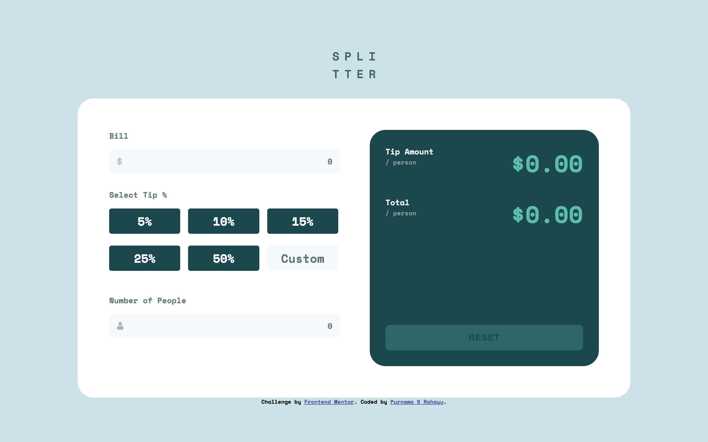

# Frontend Mentor - Tip calculator app solution

This is a solution to the [Tip calculator app challenge on Frontend Mentor](https://www.frontendmentor.io/challenges/tip-calculator-app-ugJNGbJUX). Frontend Mentor challenges help you improve your coding skills by building realistic projects.

## Table of contents

- [Overview](#overview)
  - [The challenge](#the-challenge)
  - [Screenshot](#screenshot)
  - [Links](#links)
- [My process](#my-process)
  - [Built with](#built-with)
  - [What I learned](#what-i-learned)
  - [Continued development](#continued-development)
  - [Useful resources](#useful-resources)
- [Author](#author)
- [Acknowledgments](#acknowledgments)

## Overview

### The challenge

Users should be able to:

- View the optimal layout for the app depending on their device's screen size
- See hover states for all interactive elements on the page
- Calculate the correct tip and total cost of the bill per person

### Screenshot



### Links

- Solution URL: [Github](https://github.com/catreedle/tip-calculator-app)
- Live Site URL: [Live Site](https://tip-calculator-app-catreedle.vercel.app/)

## My process

### Built with

- Semantic HTML5 markup
- CSS custom properties
- Flexbox
- CSS Grid
- Mobile-first workflow
- Vanilla JS

### What I learned

I discovered new CSS properties such as

```css
input {
  text-overflow: ellipsis;
  overflow: hidden;
  white-space: nowrap;
}
```

I learned to use radio inputs and shows them as button, and combining it with custom user input. I also learned to validate input with Javascript, and did a lot of adding and removing CSS classess with Javascript to display desired output. However, the validations could be improved to avoid unwanted input values. I also hope to revisit my JS file to refactor it to be more readable.

### Continued development

Some unwanted input: user shouldn't be able to input number with leading zero(s) like `000`, `012`.
index.js could be refactored for readability and to use pure functions.

## Author

- Website - [Purnama S Rahayu](https://www.purnamaa.dev)
- Frontend Mentor - [@catreedle](https://www.frontendmentor.io/profile/catreedle)